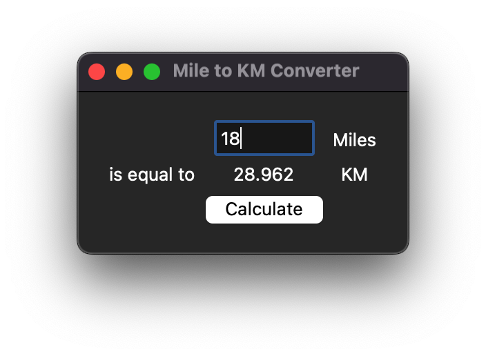

# Mile to Kilometer Converter

This is a simple Mile to Kilometer converter application built using Python's Tkinter library. The application takes input in miles and converts it to kilometers when the "Calculate" button is pressed.

## Features

- Input field for miles.
- Displays the converted value in kilometers.
- Responsive design using Tkinter's grid layout.

## Requirements

- Python 3.x
- Tkinter library (usually included with Python)

## Installation

No installation is needed beyond having Python and Tkinter set up on your machine.

## Usage

1. Run the script.
2. Enter the number of miles in the input field.
3. Press the "Calculate" button to see the equivalent distance in kilometers.

## Screenshot



## Code Overview

```python
import tkinter as tk

def miles_to_kilometers():
    miles = float(input_miles_entry.get())
    km = miles * 1.609
    km_result_label.config(text=f"{km}")

window = tk.Tk()
window.title("Mile to KM Converter")
window.config(padx=20, pady=20)

input_miles_entry = tk.Entry(width=7)
input_miles_entry.grid(column=1, row=0)

mile_label = tk.Label(text="Miles")
mile_label.grid(row=0, column=2)

is_equal_label = tk.Label(text="is equal to")
is_equal_label.grid(row=1, column=0)

km_result_label = tk.Label(text="0")
km_result_label.grid(column=1, row=1)

km_label = tk.Label(text="KM")
km_label.grid(column=2, row=1)

calculate_button = tk.Button(text="Calculate", command=miles_to_kilometers)
calculate_button.grid(column=1, row=2)

window.mainloop()
```

## How it Works

- The script creates a Tkinter window and sets up a grid layout.
- The user can input the number of miles in the provided entry field.
- Upon clicking the "Calculate" button, the `miles_to_kilometers` function is triggered.
- The function retrieves the input value, converts it to kilometers, and updates the label to display the result.
